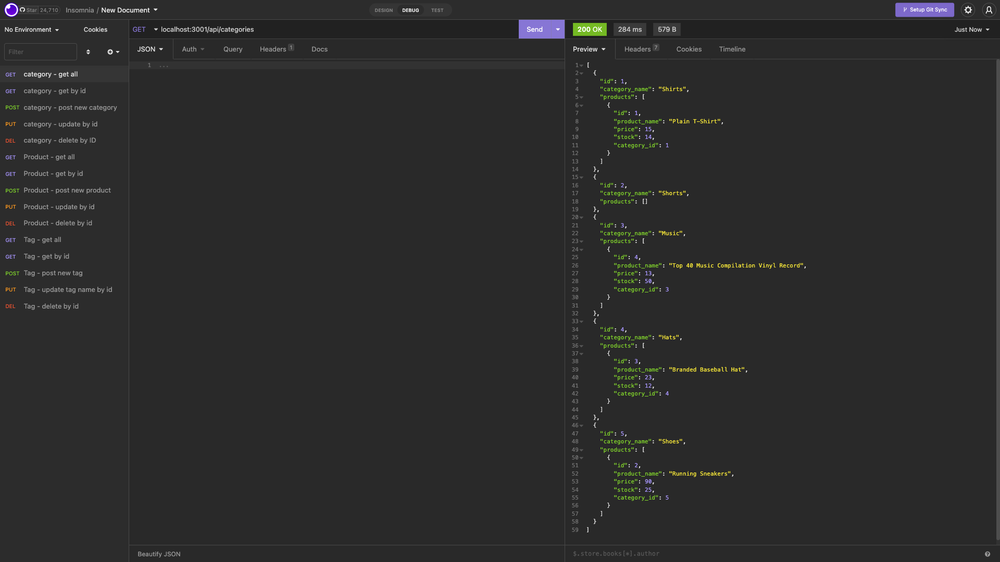

# E-Commerce-Site




## Description
---
In this challege I createed a back end build for an e-commerce site by modifying starter code.  I configured a working Express.js API to use Sequelize to interact with a MySQL database.

[Click here](https://drive.google.com/file/d/1dH3-c_Q3OOcIfszRerZ249G8yVIBMUTS/view) to see the video demonstration.


## Deployement Instructions
---

You will need to install sequelize, express, mysql2 and dotenv.

``` 
npm i <package name>
```
Then open up you db folder and run mysql:

```
mysql -u root -p
```
if you have a password, enter it then:
``` 
SOURCE schema.sql
```
You then need to open your server terminal and seed the database.
```
npm run seed
```
You can then start running
```
npm start
```
When running it should look like this:
```
App listening on port 3001!
```

You can run this in Insomnia to check all of the routes.
For each route (category-routes.js, produce-routes.js, tag-routes.js) there is a 
- get all
- get by id
- post new
- put to update by id
- delete by id

## Credits
---
- Thank you to the UTA-Bootcamp team.
- The Coding Collective
- Private tutor Scott Everett
- Private tutor David Elutilo

## License
---

Distributed under the MIT License. 

[](https://opensource.org/licenses/MIT)
